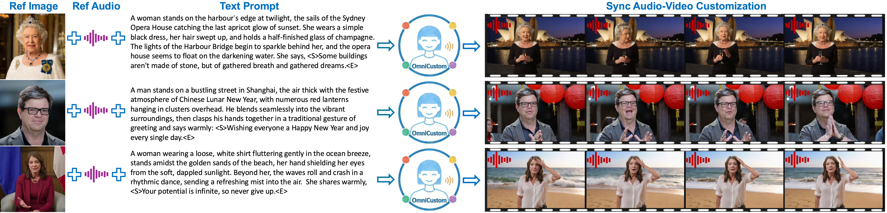

# OmniCustom: Sync Audio-Video Customization Via Joint Audio-Video Generation Model

<div align="center">

[](https://OmniCustom-project.github.io/page/)&nbsp;
<a href="https://huggingface.co/Omni1307/OmniCustom"></a>

</div>

## 🔥 Latest News!

* Feb 14, 2025: We proposed **OmniCustom**, a novel framework to deal with sync audio-video customization.  For more video demos, please visit the [project page](https://OmniCustom-project.github.io/page/).


## 🎥 Video


https://github.com/user-attachments/assets/7943515a-691b-417e-99c7-65003a63e258


## 📖 Overview

Given a reference image $I^{r}$ and a reference audio $A^{r}$, our **OmniCustom** framework synchronously generates a video that preserves the visual identity from $I^{r}$ and an audio track that mimics the timbre of $A^{r}$. Here, the speech content can be freely specified through a textual prompt.

<p align="center">
  
</p>

## ⚡️ Quickstart

### Installation

##### 1.Clone the repo:

```sh
git clone https://github.com/OmniCustom-project/OmniCustom.git
cd OmniCustom
```

##### 2. Create Environment:

```sh
conda create -n omnicustom python=3.10
conda activate omnicustom
pip install -r requirements.txt
```

##### 3. Install Flash Attention :

```sh
pip install flash-attn --no-build-isolation
```

### Model Download

| Models       | Download Link                                                                                                                                           |    Notes                      |
|--------------|---------------------------------------------------------------------------------------------------------------------------------------------------------|-------------------------------|
| OmniCustom models      | 🤗 [Huggingface](https://huggingface.co/bytedance-research/Phantom/blob/main/Phantom-Wan-1.3B.pth)   | 1.8G
| Naturalspeech 3 | 🤗 [Huggingface](https://huggingface.co/bytedance-research/Phantom/tree/main) | timbre embedding extractor
|InsightFace | 🤗 [Huggingface](https://huggingface.co/bytedance-research/Phantom/tree/main) | face embedding extractor

First you need to download the original model of OVI, Wan2.2-TI2V-5B, and MMAudio. You can download them using `download_weights.py`, and put them into `ckpts`:

```sh
python3 download_weights.py --output-dir ./ckpts
```

Then download the model of our OmniCustom, Naturalspeech 3, InsightFace from Huggingface:

```sh
pip install "huggingface_hub[cli]"
huggingface-cli download bytedance-research/Phantom --local-dir ./ckpts
huggingface-cli download bytedance-research/Phantom --local-dir ./ckpts
huggingface-cli download bytedance-research/Phantom --local-dir ./ckpts
```

## ⚙️ Configure OmniCustom

The configure file of  OmniCustom [OmniCustom/configs/inference/inference_fusion.yaml](configs/inference/inference_fusion.yaml) can be modified. The following parameters control generation quality, video resolution, and how text, image, and audio inputs are balanced:

```yaml
ckpt_name: Ovi/model.safetensors  #base model
lora_path: ./ckpts/step-92000.safetensors #the checkpoint of our OmniCustom
self_lora: true 
# face embedder 
face_embedder_ckpt_dir: ./ckpts/InsightFace  
face_ip_emb_dim: 512   
# audio embedder
audio_embedder_ckpt_dir: ./ckpts/naturalspeech3_facodec
audio_ip_emb_dim: 256 
# output
output_dir: ./outputs/
sample_steps: 50  # number of denoising steps. Lower (30-40) = faster generation
solver_name: unipc  # sampling algorithm for denoising process
shift: 5.0    #timestep shift factor for sampling scheduler
sp_size: 1
audio_guidance_scale: 3.0
video_guidance_scale: 4.0
mode: "id2v"                                                  # ["id2v", "t2v", "i2v", "t2i2v"] all comes with audio
fp8: False                        # load fp8 version of model, will have quality degradation and will not have speed 
cpu_offload: False
seed: 102                    # random seed for reproducible results
crop_face: true        # crop face region from the reference image
video_negative_prompt: "jitter, bad hands, blur, distortion, two people, two persons, aerial view, overexposed, low quality, deformation, a poor composition, bad hands, bad teeth, bad eyes, bad limbs, distortion, blurring, text, subtitles, static, picture, black border" 
audio_negative_prompt: "robotic, muffled, echo, distorted"    # avoid artifacts in audio
video_frame_height_width: [576, 992] #[512, 992]                         # only useful if mode = t2v or t2i2v, recommended values: [512, 992], [992, 512], [960, 512], [512, 960], [720, 720], [448, 1120]
text_prompt: ./example_prompts/benchmark_example.csv  #group generation
slg_layer: 11
each_example_n_times: 1
```


## 🔑 Inference

##### Single GPU

```bash
bash ./inference.sh
```

Or run:

```bash
CUDA_VISIBLE_DEVICES=0  infer.py --config-file ./configs/inference/inference_fusion.yaml
```
> 💡Note:
> 
> * `text_prompt` in `configs/inference/inference_fusion.yaml` can change examples for sync audio-video customization. `text_prompt` supports a CSV file, which contains text_prompt,image_path,ip_image_path, and ip_audio_path.
> * Those results without any customization and those with only identity customization will be saved to the result folder.
> * When the generated video is unsatisfactory, the most straightforward solution is to try changing the `seed` in `configs/inference/inference_fusion.yaml`.
> * The Peak VRAM Required is 80 GB in a single GPU.


##### More Results
<table width="100%" border="1" cellpadding="20" cellspacing="0" align="center" style="border-collapse: collapse; font-family: -apple-system, BlinkMacSystemFont, 'Segoe UI', sans-serif;">
  <thead>
    <tr bgcolor="#f5f5f5">
      <th style="width:18%; padding:16px; border:1px solid #ddd; font-size:14px;">Reference Images</th>
      <th style="width:18%; padding:16px; border:1px solid #ddd; font-size:14px;">Reference Audios</th>
      <th style="width:24%; padding:16px; border:1px solid #ddd; font-size:14px;">Text prompts</th>
      <th style="width:40%; padding:16px; border:1px solid #ddd; font-size:14px;">Generated Videos</th>
    </tr>
  </thead>
  <tbody>
    <tr>
      <!-- 行1 -->
      <td align="center" style="vertical-align:middle; padding:16px; border:1px solid #ddd; min-height:300px;">
        
      </td>
      <td align="center" style="vertical-align:middle; padding:16px; border:1px solid #ddd; min-height:300px;">
        <!-- 音频：显示为播放按钮，点击在新窗口播放 -->
        <a href="https://github.com/user-attachments/assets/281b285a-80bc-482e-a62b-6f1cce389c6a">
          
        </a>
      </td>
      <td style="line-height:1.6; vertical-align:middle; padding:16px; border:1px solid #ddd; font-size:13px; min-height:300px;">
        <div style="max-height:280px; overflow-y: auto; padding-right: 8px;">
          A man stands at the podium in OpenAI's luxurious conference room, behind him a massive electronic screen displays the company's glowing profit data. He grips the microphone firmly, gazes across the audience below, and announces in a steady tone: &lt;S&gt;The board wants to sell OpenAI to Zuckerberg, which is unacceptable.&lt;E&gt;
        </div>
      </td>
      <td align="center" style="vertical-align:middle; padding:16px; border:1px solid #ddd; min-height:300px;">
        <!-- 视频：显示缩略图+播放按钮，点击在新窗口播放 -->
        <a href="https://github.com/user-attachments/assets/5472ec3d-57bc-45b3-a921-7913d0bd8bb7">
          
        </a>
      </td>
    </tr>
    <tr>
      <!-- 行2 -->
      <td align="center" style="vertical-align:middle; padding:16px; border:1px solid #ddd; min-height:300px;">
        
      </td>
      <td align="center" style="vertical-align:middle; padding:16px; border:1px solid #ddd; min-height:300px;">
        <a href="https://github.com/user-attachments/assets/a6294f38-ba3a-449c-b8e3-8fce181124fe">
          
        </a>
      </td>
      <td style="line-height:1.6; vertical-align:middle; padding:16px; border:1px solid #ddd; font-size:13px; min-height:300px;">
        <div style="max-height:280px; overflow-y: auto; padding-right: 8px;">
          A woman stands before the iconic Rockefeller Center Christmas Tree, its thousands of lights reflecting in her eyes as snow begins to fall gently around her. Wearing a tartan scarf and holding a cup of steaming cocoa, she brings her mittened hands together and speaks softly into the frosty air: &lt;S&gt;May the spirit of Christmas fill your heart throughout the coming year.&lt;E&gt;
        </div>
      </td>
      <td align="center" style="vertical-align:middle; padding:16px; border:1px solid #ddd; min-height:300px;">
        <a href="https://github.com/user-attachments/assets/1ba22392-705c-42c7-a00b-073925c37b37">
          
        </a>
      </td>
    </tr>
    <tr>
      <!-- 行3 -->
      <td align="center" style="vertical-align:middle; padding:16px; border:1px solid #ddd; min-height:300px;">
        
      </td>
      <td align="center" style="vertical-align:middle; padding:16px; border:1px solid #ddd; min-height:300px;">
        <a href="https://github.com/user-attachments/assets/d7399bc5-60cb-4d6e-9af2-06306694e4f2">
          
        </a>
      </td>
      <td style="line-height:1.6; vertical-align:middle; padding:16px; border:1px solid #ddd; font-size:13px; min-height:300px;">
        <div style="max-height:280px; overflow-y: auto; padding-right: 8px;">
          A man stands on a bustling street in Shanghai, the air thick with the festive atmosphere of Chinese Lunar New Year, with numerous red lanterns hanging in clusters overhead. He blends seamlessly into the vibrant surroundings, then clasps his hands together in a traditional gesture of greeting and says warmly: &lt;S&gt;Wishing everyone a Happy New Year and joy every single day.&lt;E&gt;
        </div>
      </td>
      <td align="center" style="vertical-align:middle; padding:16px; border:1px solid #ddd; min-height:300px;">
        <a href="https://github.com/user-attachments/assets/1925cc0b-1ab5-4ce7-b6c9-33a64152d195">
          
        </a>
      </td>
    </tr>
  </tbody>
</table>


## 📑 Todo List

- [x] Inference Codes and Checkpoint of OmniCustom
- [ ] Open Source Evaluation Benchmark
- [ ] Open Source OmniCustom-1M dataset
- [ ] Training Codes of OmniCustom

## 🙏 Acknowledgements

We would like to thank the following projects:

**[OVI](https://github.com/character-ai/Ovi)**: Our OmniCustom is finetuned over OVI for ID and timbre customization.

**[Naturalspeech 3](https://github.com/lifeiteng/naturalspeech3_facodec)**: 256-D timbre embeddings are extracted using Naturalspeech 3.

**[InsightFace](https://github.com/deepinsight/insightface)**: 512-D face embeddings are extracted using InsightFace.

**[MMAudio](https://github.com/hkchengrex/MMAudio)**: Audio VAE is provided by MMAudio.

**[Wan2.2](https://github.com/Wan-Video/Wan2.2)**: The video branch is initialized from the Wan2.2 repository.

## ⭐

If OmniCustom is helpful, please help to ⭐ the repo.

## 📚 Citation

We will link the paper soon.
